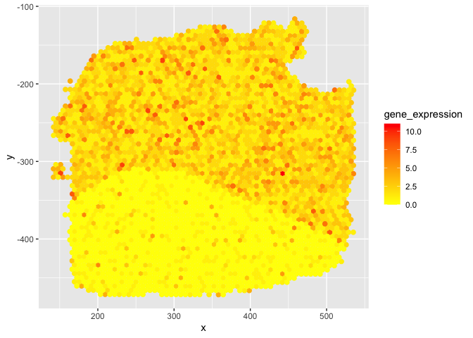
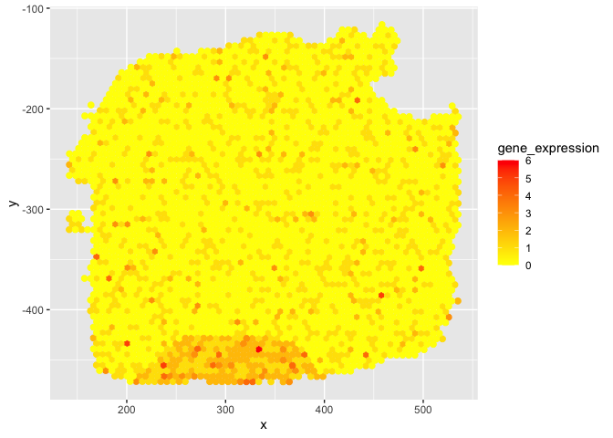
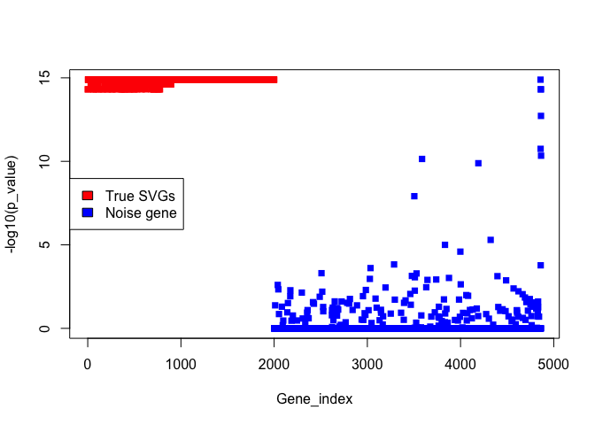
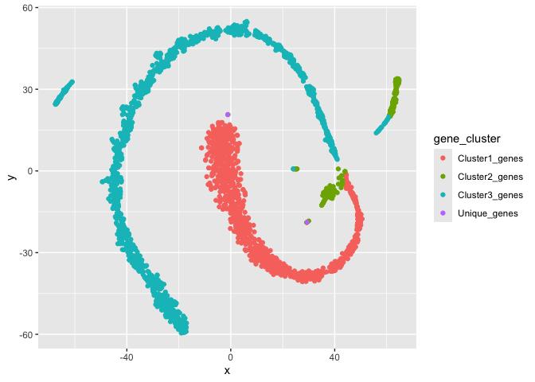

Simulation domain detection
================

## First let’s generate the synthetic datasets.

``` r
library(SPARK)
library(Seurat)
library(SpatialPCA)
library(ggplot2)
library(mclust)

source("simulate_synthetic_data.R")
seed1=2
sim_data=fn_generate_synthetic_data(seed1=2)
```

    ## [1] 3484

``` r
names(sim_data)
```

    ## [1] "dataset"   "xy_coords" "truth"

``` r
str(sim_data)
```

    ## List of 3
    ##  $ dataset  : num [1:4865, 1:3484] 6 19 5 1 3 2 2 3 2 3 ...
    ##   ..- attr(*, "dimnames")=List of 2
    ##   .. ..$ : chr [1:4865] "gene1" "gene2" "gene3" "gene4" ...
    ##   .. ..$ : chr [1:3484] "AAACAAGTATCTCCCA-1" "AAACACCAATAACTGC-1" "AAACAGAGCGACTCCT-1" "AAACAGCTTTCAGAAG-1" ...
    ##  $ xy_coords: num [1:3484, 1:2] 458 200 433 170 182 ...
    ##   ..- attr(*, "dimnames")=List of 2
    ##   .. ..$ : chr [1:3484] "AAACAAGTATCTCCCA-1" "AAACACCAATAACTGC-1" "AAACAGAGCGACTCCT-1" "AAACAGCTTTCAGAAG-1" ...
    ##   .. ..$ : chr [1:2] "x_coord" "y_coord"
    ##  $ truth    : chr [1:3484] "Layer4" "Layer6" "Layer3" "Layer4" ...

``` r
save(sim_data, file = paste0("Synthetic_datasets/data",seed1,".RData"))
```

## lets look at some domain genes

``` r
#load(paste0("Synthetic_datasets/data",seed1,".RData"))

dataset=sim_data$dataset
loc_df=sim_data$xy_coords

library(ggplot2)

g=1
df1=data.frame(x=loc_df[,1],y=loc_df[,2],gene_expression=dataset[g,])
gg=ggplot(df1, aes(x = x, y = y, colour = gene_expression)) +
  geom_point(size=2)+scale_colour_gradient(low="yellow",high="Red")
print(gg)
```

<!-- -->

``` r
g=851
df1=data.frame(x=loc_df[,1],y=loc_df[,2],gene_expression=dataset[g,])
gg=ggplot(df1, aes(x = x, y = y, colour = gene_expression)) +
  geom_point(size=2)+scale_colour_gradient(low="yellow",high="Red")
print(gg)
```

<!-- -->

``` r
g=905
df1=data.frame(x=loc_df[,1],y=loc_df[,2],gene_expression=dataset[g,])
gg=ggplot(df1, aes(x = x, y = y, colour = gene_expression)) +
  geom_point(size=2)+scale_colour_gradient(low="yellow",high="Red")
print(gg)
```

<!-- -->

``` r
g=1015
df1=data.frame(x=loc_df[,1],y=loc_df[,2],gene_expression=dataset[g,])
gg=ggplot(df1, aes(x = x, y = y, colour = gene_expression)) +
  geom_point(size=2)+scale_colour_gradient(low="yellow",high="Red")
print(gg)
```

<!-- -->

## Pre-processing and normalization of dataset

``` r
library(scater)
library(scran)
library(scry)
library(scuttle)

dataset=sim_data$dataset
loc_df=sim_data$xy_coords

count_df=as.matrix(dataset)
loc_df=as.matrix(loc_df)
count_df[1:5,1:5]
```

    ##       AAACAAGTATCTCCCA-1 AAACACCAATAACTGC-1 AAACAGAGCGACTCCT-1
    ## gene1                  6                  6                  4
    ## gene2                 19                 15                  4
    ## gene3                  5                  4                  1
    ## gene4                  1                  1                  0
    ## gene5                  3                  3                  1
    ##       AAACAGCTTTCAGAAG-1 AAACAGGGTCTATATT-1
    ## gene1                  6                  6
    ## gene2                 14                 14
    ## gene3                  4                  3
    ## gene4                  1                  1
    ## gene5                  3                  2

``` r
norm_df=scuttle::normalizeCounts(count_df,transform="log")
norm_df[1:5,1:5]
```

    ##       AAACAAGTATCTCCCA-1 AAACACCAATAACTGC-1 AAACAGAGCGACTCCT-1
    ## gene1          1.3925484          1.5125458          1.3733545
    ## gene2          2.6199210          2.4938590          1.3733545
    ## gene3          1.2354311          1.1605462          0.4830348
    ## gene4          0.3458544          0.3883054          0.0000000
    ## gene5          0.8581482          0.9460311          0.4830348
    ##       AAACAGCTTTCAGAAG-1 AAACAGGGTCTATATT-1
    ## gene1          1.6268447          1.6390844
    ## gene2          2.5540630          2.5690671
    ## gene3          1.2583654          1.0407806
    ## gene4          0.4308862          0.4355719
    ## gene5          1.0315251          0.7696818

``` r
rm(count_df)
data_mat=norm_df #4865 3484
coord_df=loc_df
dim(norm_df)
```

    ## [1] 4865 3484

Note: Some functions might take too long to run without the help of
computer clusters. So All the intermediate datasets and results are
saved in the Github folders for generating part of the results.

## Step 1 of SPACE

``` r
source("fn_main_par.R")
final1=fn_cSVG_par(data_mat=data_mat[1:5,],loc_mat=coord_df,method_step1="MargcorTest",thres_step1="standard",control=FALSE,ncores=7)
p_adj1=p.adjust(final1[,11], method = "BY")
cSVG_SVG=which(p_adj1<0.05)
write.csv(final1,paste0("Simulation_domainDetection_Results/cSVG_step1_",seed1,".csv"))
```

## visualizing results from step 1

``` r
final1=read.csv(paste0("Simulation_domainDetection_Results/cSVG_step1_",seed1,".csv"),row.names=1)
p_adj1=p.adjust(final1[,11], method = "BY")
plot(1:dim(final1)[1],-log10(p_adj1),xlab="Gene_index",ylab="-log10(p_value)",col=c(rep("red",2000),rep("blue",2865)),pch=15) 
legend("left",c("True SVGs","Noise gene"),fill=c("red","blue"))
```

<!-- -->

## Step 2 of SPACE

``` r
final1=read.csv(paste0("Simulation_domainDetection_Results/cSVG_step1_",seed1,".csv"),row.names=1)
p_adj1=p.adjust(final1[,11], method = "BY")
cSVG_SVG=which(p_adj1<0.05)

final1=fn_cSVG_par(data_mat=data_mat[cSVG_SVG,],loc_mat=coord_df,method_step1="MargcorTest",thres_step1="standard",control=TRUE,ncores=7)
write.csv(final1$final,paste0("Simulation_domainDetection_Results/cSVG_step2_",seed1,".csv"))
list_g=final1$list_g
mat=matrix(0,nrow=length(list_g),ncol=1)
for(i in 1:length(list_g)){
    mat[i,]=paste(list_g[[i]],collapse=",")
}
write.csv(mat,paste0("Simulation_domainDetection_Results/cSVG_glist_",seed1,".csv"))
```

## Final step: Clustering SVGs based on step 2 result

``` r
data11=read.csv(paste0("Simulation_domainDetection_Results/cSVG_step1_",seed1,".csv"),row.names = 1)
p_adj=p.adjust(data11[,11], method = "BY")
SE_genes=rownames(data11)[which(p_adj<0.05)]

data21=read.csv(paste0("Simulation_domainDetection_Results/cSVG_step2_",seed1,".csv"),row.names = 1)
p_adj=p.adjust(data21[,11], method = "BY")
DEC_genes=rownames(data21)[which(p_adj<0.05)]

library(igraph)
list1=read.csv(paste0("Simulation_domainDetection_Results/cSVG_glist_",seed1,".csv"),row.names = 1)
list1=list1[-1,]

source("gene_cluster.R")
out1=fn_cluster_genes(SE_genes,list1,DEC_genes)
write.csv(out1,paste0("Simulation_domainDetection_Results/synth_Spclusters_",seed1,".csv"))
```

## Visualizing the cluster results

``` r
library(ggplot2)

load(paste0("Synthetic_datasets/data",seed1,".RData"))
dataset=sim_data$dataset
loc_df=sim_data$xy_coords
truth=sim_data$truth
genes=rownames(dataset)

res=read.csv(paste0("Simulation_domainDetection_Results/synth_Spclusters_",seed1,".csv"))
table(res[,2])
```

    ## 
    ##    1    2    3    4    5 
    ##  801  142 1123    1    1

``` r
g_name1=res[which(res[,2]==1),1] 
g_name2=res[which(res[,2]==2),1] 
g_name3=res[which(res[,2]==3),1] 
g_name_oth=res[which(res[,2] %in% 4:5),1] 


dataset_reorg=dataset[c(which(genes %in% g_name1),which(genes %in% g_name2),which(genes %in% g_name3),which(genes %in% g_name_oth)),]

# t-SNE plot for genes clusters 

# Load the required packages
library(Rtsne)
library(ggplot2)

# try with whole data 
data=dataset_reorg #all clusters
clust1=c(rep("Cluster1_genes",length(g_name1)),rep("Cluster2_genes",length(g_name2)),rep("Cluster3_genes",length(g_name3)),rep("Unique_genes",length(g_name_oth)))
tsne_out <- Rtsne(data,theta=0) 
tsne_plot <- data.frame(x = tsne_out$Y[,1], y = tsne_out$Y[,2],gene_cluster=clust1)
ggplot2::ggplot(tsne_plot) + geom_point(aes(x=x,y=y,col=gene_cluster))
```

<!-- -->

## Now using SpatialPCA to find low dimension embeddings for main clusters and finding spatial domains.

### Used the default parameter values used in SpatialPCA code.

``` r
clusterNum=5

load(paste0("Synthetic_datasets/data",seed1,".RData"))
dataset=sim_data$dataset
loc_df=sim_data$xy_coords
truth=sim_data$truth


library(SPARK)
library(Seurat)
library(SpatialPCA)
library(ggplot2)
library(mclust)
library(bluster)

g_name=g_name1
LIBD1 = CreateSpatialPCAObject(counts=dataset, location=loc_df, project = "SpatialPCA",gene.type="spatial",sparkversion="sparkx",numCores_spark=5,gene.number=3000, customGenelist=g_name,min.loctions = 20, min.features=20)
```

    ## ## Use SCTransform function in Seurat to normalize data. 
    ## ## Custom gene list contains  801  genes. 
    ## ## In total  801  custom genes are matched with genes in the count matrix. 
    ## ## Use  801  custom genes for analysis.

``` r
LIBD1 = SpatialPCA_buildKernel(LIBD1, kerneltype="gaussian", bandwidthtype="SJ",bandwidth.set.by.user=NULL)
```

    ## ## Selected kernel type is:  gaussian  
    ## ## The bandwidth is:  0.00642762569886129  
    ## ## Calculating kernel matrix
    ## ## Finished calculating kernel matrix.

``` r
LIBD1 = SpatialPCA_EstimateLoading(LIBD1,fast=FALSE,SpatialPCnum=20)
```

    ## [1] "Eigen decomposition on kernel matrix!"
    ## [1] "Using all eigenvectors and eigenvalues in the Kernel matrix!"

``` r
LIBD1 = SpatialPCA_SpatialPCs(LIBD1, fast=FALSE)

g_name=g_name2
LIBD2 = CreateSpatialPCAObject(counts=dataset, location=loc_df, project = "SpatialPCA",gene.type="spatial",sparkversion="sparkx",numCores_spark=5,gene.number=3000, customGenelist=g_name,min.loctions = 20, min.features=20)
```

    ## ## Use SCTransform function in Seurat to normalize data. 
    ## ## Custom gene list contains  142  genes. 
    ## ## In total  142  custom genes are matched with genes in the count matrix. 
    ## ## Use  142  custom genes for analysis.

``` r
LIBD2 = SpatialPCA_buildKernel(LIBD2, kerneltype="gaussian", bandwidthtype="SJ",bandwidth.set.by.user=NULL)
```

    ## ## Selected kernel type is:  gaussian  
    ## ## The bandwidth is:  0.0191179460018271  
    ## ## Calculating kernel matrix
    ## ## Finished calculating kernel matrix.

``` r
LIBD2 = SpatialPCA_EstimateLoading(LIBD2,fast=FALSE,SpatialPCnum=20)
```

    ## [1] "Eigen decomposition on kernel matrix!"
    ## [1] "Using all eigenvectors and eigenvalues in the Kernel matrix!"

``` r
LIBD2 = SpatialPCA_SpatialPCs(LIBD2, fast=FALSE)

g_name=g_name3
LIBD3 = CreateSpatialPCAObject(counts=dataset, location=loc_df, project = "SpatialPCA",gene.type="spatial",sparkversion="sparkx",numCores_spark=5,gene.number=3000, customGenelist=g_name,min.loctions = 20, min.features=20)
```

    ## ## Use SCTransform function in Seurat to normalize data. 
    ## ## Custom gene list contains  1123  genes. 
    ## ## In total  1123  custom genes are matched with genes in the count matrix. 
    ## ## Use  1123  custom genes for analysis.

``` r
LIBD3 = SpatialPCA_buildKernel(LIBD3, kerneltype="gaussian", bandwidthtype="SJ",bandwidth.set.by.user=NULL)
```

    ## ## Selected kernel type is:  gaussian  
    ## ## The bandwidth is:  0.00732339661553216  
    ## ## Calculating kernel matrix
    ## ## Finished calculating kernel matrix.

``` r
LIBD3 = SpatialPCA_EstimateLoading(LIBD3,fast=FALSE,SpatialPCnum=20)
```

    ## [1] "Eigen decomposition on kernel matrix!"
    ## [1] "Using all eigenvectors and eigenvalues in the Kernel matrix!"

``` r
LIBD3 = SpatialPCA_SpatialPCs(LIBD3, fast=FALSE)

SP=rbind(LIBD1@SpatialPCs[1:5,],LIBD2@SpatialPCs[1:5,],LIBD3@SpatialPCs[1:5,])

pred_cluster1= walktrap_clustering(clusterNum,SP,knearest=70 ) 
clusterlabel_refine1=refine_cluster_10x(pred_cluster1,loc_df,shape="hexagon") 

ARI=adjustedRandIndex(clusterlabel_refine1,truth)
print(paste0("The ARI is:", ARI)) 
```

    ## [1] "The ARI is:0.903492989784978"

``` r
PAS = fx_PAS(clusterlabel_refine1,loc_df)
print(paste0("The PAS is:", PAS)) 
```

    ## [1] "The PAS is:0.0304247990815155"

## Visualize the spatial domains.

``` r
cbp=c("#5CB85C" ,"#9C9EDE" ,"#FFDC91", "#4DBBD5" ,"#FF9896")
plot_cluster(location=loc_df,clusterlabel_refine1,pointsize=4,text_size=40 ,title_in=paste0("SPACE_",seed1),color_in=cbp)
```

<!-- -->
